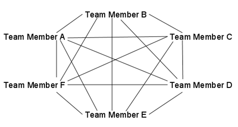
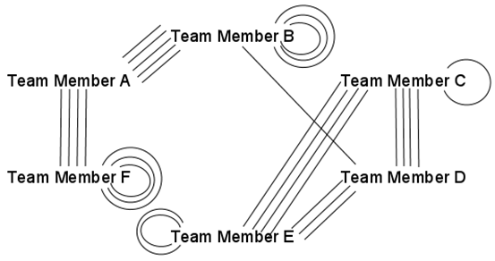

# Work with a Star and Get Rid of the Truck Factor

Introducing pair programming into an agile software project helps to increase the productivity of the team. By continuously rotating pairs and tasks, knowledge of the whole project is spread across all team members in a fast and efficient way. Therefore, the team gets rid of the _truck factor_ where important knowledge is possessed by only by a few key people.

Pair programming may sound scary in the beginning, because each programmer potentially exposes their vulnerabilities to someone while working closely with them. However, the discussions pair programming brings out help solve problems faster and better. Pair programming also leads to ongoing code review. Pair programming is an excellent technique for training up new team members. The new team member is not left alone and can start developing (and be productive) right away. For experienced programmers, one challenge with pair programming might be patience with younger and less-experienced programmers. Pair programming, however, forces all team members to challenge themselves in a safe setting and give team members the chance to both broaden and deepen their skills.

One of our experiences, however, is that team members can become overcommitted to fulfilling the task or user story they have started. We have therefore introduced a two-day rotation rule and a rotation star to hold a record of the rotation.

_Two-day rule_ — each pair splits up every day, with the one who has stayed longest working on the task rotating out of the pair to a new task, i.e., each team member rotate task at least every second day.

_Rotation star_ — visualize which team member has worked with whom, with one line representing one day of pair programming between team members.

At the start of iteration, the rotation star includes only the team members' names, and at the end of iteration the star should look like Figure 1. This implies that the whole team has gained knowledge about all user stories within the iteration, and competences have been spread throughout the team.

If the rotation star looks like Figure 2 at the end of the iteration, the team has failed to involve all its members on all of its tasks. For instance, the curved lines indicate that team members B and F have worked a lot alone most likely on the same task. Figure 2 also illustrates that team members A and B probably have worked together on the same task several days in a row.

When a new team member is introduced, we recommend rotating pairs less frequently. In the beginning, it might be confusing rotating to a new task every second day.

The two-day rule and the rotation star ensure project progress regardless of illness or vacation, and therefore the team becomes less vulnerable to unexpected incidents — the team reduces the truck factor.

By [Cecilia Sjolin](http://programmer.97things.oreilly.com/wiki/index.php/Cecilia_Sj%C3%B6lin) and [Ida Hveding Huse](http://programmer.97things.oreilly.com/wiki/index.php/Ida_Hveding_Huse)
